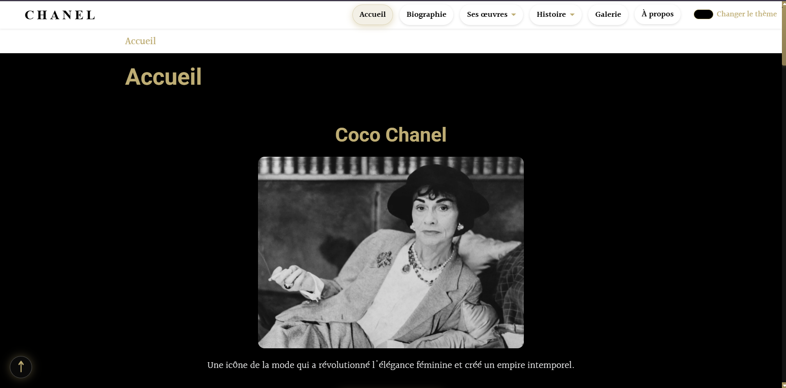

<p align="center">
  
</p>

# Coco Chanel — Tribute Website

**Note:** The Web page interface is in French.

A tribute website dedicated to **Coco Chanel** and her revolutionary impact on fashion, created as a school project.

## About
This website showcases Coco Chanel's life, career journey, and lasting legacy through clean design and intuitive navigation.

## Features
- Responsive design
- Biography and timeline
- Gallery of iconic designs
- Clean and elegant interface

## Technologies
- HTML5, CSS3, JavaScript
- Bootstrap framework
- Google Fonts

## Getting Started
```bash
git clone https://github.com/jktchikapa/coco-chanel-website.git
cd coco-chanel-website
```

Open `index.html` in your browser to view the website.

## Credits
| Jessica Karelle | [](https://github.com/jktchikapa) |
| Patricelie Rimelda | [](https://github.com/Patricelie) |

## License
Educational Project